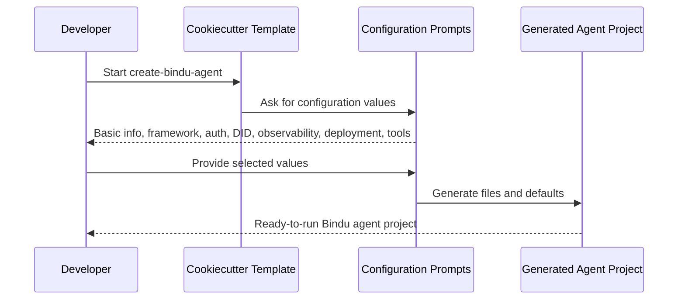

Configuration is where the template stops being generic and starts looking like your agent. The prompts are straightforward, but they control identity, behavior, observability, deployment, storage, and the developer tooling that gets generated with the project.

## Why Configuration Matters

When you run `create-bindu-agent`, you are not just filling in metadata. You are deciding how the generated project behaves, what infrastructure it expects, and which pieces are turned on from day one.

<Note>
This page is the complete reference for every configuration option available during setup, plus the internal defaults that are applied automatically.
</Note>

## How Configuration Works

The cookiecutter template walks through the configuration in a fixed order. Each section controls one part of the generated project.

### The Prompt Flow

<CardGroup cols={3}>
  <Card title="Project Identity" icon="user">
    Author, project name, versioning, and the framework choice define the base shape of the generated project.
  </Card>
  <Card title="Runtime Behavior" icon="sliders">
    Auth, DID, PKI, history, telemetry, storage, scheduling, and deployment settings shape how the agent runs.
  </Card>
  <Card title="Developer Tooling" icon="wrench">
    Type checking, CI/CD, docs, coverage, containers, and licensing decide what ships with the scaffold.
  </Card>
</CardGroup>

<Steps>
  <Step title="Fill In Project Basics">
    Start with the fields that identify the project and choose the framework it will use.
  </Step>

  <Step title="Choose Runtime Features">
    Decide how the generated agent should handle skills, auth, identity, observability, cost tracking, storage, and deployment.
  </Step>

  <Step title="Select Development Tooling">
    Finish with the developer tooling, generated extras, and license settings.
  </Step>
</Steps>

---

## Basic Information

Let's start with the basics - tell us about yourself and your agent!

<ParamField path="author" type="string" default="Your Name">
  Your name or organization name
</ParamField>

<ParamField path="email" type="string" default="your.email@example.com">
  Your contact email address
</ParamField>

<ParamField path="author_github_handle" type="string" default="your_github_handle">
  Your GitHub username (we'll use this for GitHub Actions)
</ParamField>

<ParamField path="project_name" type="string" default="my-bindu-agent">
  What should we call your agent project? (this becomes the folder name)
</ParamField>

<ParamField path="project_description" type="string" default="A Bindu AI agent for intelligent task handling">
  Briefly describe what your agent does
</ParamField>

## Agent Framework

Pick your favorite AI framework - we'll handle all the Bindu integration for you!

<ParamField path="agent_framework" type="select" default="agno">
  Choose your preferred agent framework:
  - **agno** - Lightweight and super fast ⚡
  - **langchain** - Full-featured with tons of integrations 🦜
  - **crew** - Perfect for multi-agent teams 👥
  - **fastagent** - High-performance when speed matters 🚀
  - **openai agent** - Native OpenAI integration 🤖
  - **google adk agent** - Google's Agent Development Kit 🔍
  - **custom** - Bring your own framework 🛠️
</ParamField>

## Skills And Capabilities

Want to give your agent some special powers? Choose a pre-built skill or start from scratch!

<ParamField path="primary_skill" type="select" default="none">
  Choose a primary skill for your agent (optional):
  - **none** - Start fresh and build your own skills 🎯
  - **finance** - Financial analysis and planning 💰
  - **financial-coach** - Personal finance coaching 💸
  - **competitor-analysis** - Market and competitor research 📊
  - **startup-analyst** - Startup evaluation and analysis 🚀
  - **explainable-business-reasoning** - Business logic explanation 🧠
  - **deep-research** - In-depth research capabilities 🔬
  - **analyze-paper** - Academic paper analysis 📚
  - **hackernews-analysis** - Hacker News trend analysis 📰
  - **media-trend-analysis** - Media and trend monitoring 📺
  - **instagram-post** - Social media content creation 📸
  - **meme-generator** - Fun meme and content generation 😄
  - **screenplay-writer** - Creative writing assistance 🎬
  - **recipe-creator** - Recipe generation and cooking 👨‍🍳
  - **youtube** - YouTube content optimization 🎥
  - **web-extraction** - Web data extraction 🌐
  - **travel-planner** - Travel itinerary planning ✈️
  - **surprise-travel-planning** - Spontaneous trip suggestions 🎲
  - **shopping-partner** - Smart shopping assistance 🛍️
  - **movie-recommender** - Personalized movie recommendations 🎬
  - **personalized-book-recommendation** - Book suggestions 📖
  - **breakup-recovery** - Emotional support and healing 💚
  - **cbt-clinical-critic** - Cognitive behavioral therapy critique 🧠
  - **cbt-drafter** - CBT content drafting ✍️
  - **cbt-safety-guardian** - Safety monitoring 🛡️
  - **cbt-supervisor-orchestrator** - CBT supervision 👨‍⚕️
  - **system-architect-advisor** - System architecture guidance 🏗️
  - **biomni** - Biological data analysis 🧬
  - **legal-consultant** - Legal advice and consultation ⚖️
  - **zk-policy** - Zero-knowledge policy analysis 🔐
</ParamField>

<ParamField path="skill_names" type="string" default="question-answering,pdf-processing">
  Comma-separated list of skill names (e.g., `question-answering,pdf-processing,web-search`)
  We will create a template folder for each skill. You need to complete them.
</ParamField>

## Runtime Features

Runtime configuration is where the generated agent starts to pick up real infrastructure behavior.

<AccordionGroup>
  <Accordion title="Authentication & Security">
    <ParamField path="enable_auth" type="select" default="y">
      Enable authentication for your agent
      - **y** - Enable authentication
      - **n** - No authentication (not recommended for production)
    </ParamField>

    <ParamField path="auth_provider" type="select" default="auth0">
      Choose authentication provider:
      - **auth0** - Auth0 authentication
      - **cognito** (not implemented yet)
      - **azure ad** (not implemented yet)
      - **google** (not implemented yet)
      - **custom** (not implemented yet)
      - **none** - No authentication
    </ParamField>
  </Accordion>

  <Accordion title="Identity & Cryptography">
    <ParamField path="enable_did" type="select" default="y">
      Enable Decentralized Identifier (DID) for your agent
      We would encourage you to enable DID for your agent. That will help to provide an identity to your agent.
      We have not added decentralised identity support yet. But thats our roadmap.
      - **y** - Enable DID
      - **n** - Disable DID
    </ParamField>

    <ParamField path="enable_pki" type="select" default="y">
      Enable Public Key Infrastructure
      We would encourage you to enable PKI for your agent. That will create an internal folder for your agent's keys.
      - **y** - Enable PKI
      - **n** - Disable PKI
    </ParamField>

    <ParamField path="recreate_keys" type="select" default="y">
      Recreate cryptographic keys on each deployment.
      - **y** - Recreate keys
      - **n** - Reuse existing keys
    </ParamField>

    <ParamField path="verification_key_type" type="select" default="rsa">
      Type of verification key:
      - **rsa** - RSA encryption
      - **ecdsa** - Elliptic Curve Digital Signature Algorithm
    </ParamField>
  </Accordion>

  <Accordion title="Agent Behavior">
    <ParamField path="enable_system_message" type="select" default="y">
      Enable system message for agent instructions. When enabled, a system message is added to your agent's prompts to ensure it follows the "input-required" protocol correctly.
      - **y** - Enable system message
      - **n** - Disable system message
    </ParamField>

    <ParamField path="enable_context_based_history" type="select" default="n">
      Enable context-based conversation history. When enabled, the agent maintains context across tasks, which may improve performance but could also increase hallucination risk. Monitor your agent's output carefully if you enable this feature.
      - **y** - Enable context-based history
      - **n** - Use simple history
    </ParamField>
  </Accordion>

  <Accordion title="Observability & Monitoring">
    <ParamField path="enable_telemetry" type="select" default="y">
      Enable telemetry for monitoring. When enabled, the agent sends telemetry data to the observability provider.
      - **y** - Enable telemetry
      - **n** - Disable telemetry
    </ParamField>

    <ParamField path="enable_llm_observability" type="select" default="y">
      Enable LLM-specific observability. Uses [OpenInference](https://github.com/Arize-ai/openinference) to track LLM usage. This format is respected by many observability providers.
      - **y** - Enable LLM observability
      - **n** - Disable LLM observability
    </ParamField>

    <ParamField path="llm_observability_provider" type="select" default="phoenix">
      Choose LLM observability provider:
      - **phoenix** - Arize Phoenix
      - **langfuse** - Langfuse (not properly tested yet)
    </ParamField>

    <ParamField path="use_jaeger" type="select" default="y">
      Enable Jaeger for distributed tracing
      - **y** - Enable Jaeger
      - **n** - Disable Jaeger
    </ParamField>
  </Accordion>

  <Accordion title="Cost Tracking">
    <ParamField path="enable_execution_cost" type="select" default="n">
      Track execution costs and enable payment requirements. When enabled, clients must pay for each request. A configuration will be created with settings like amount ($0.0001), token (USDC), network (base-sepolia), payment address, and protected methods. The payment flow respects the X402 protocol. For more details, see the payment documentation.
      - **y** - Enable cost tracking
      - **n** - Disable cost tracking
    </ParamField>
  </Accordion>

  <Accordion title="Storage & Scheduling">
    <ParamField path="storage_type" type="select" default="memory">
      Choose storage backend. All workers use shared storage to track tasks and persist data. For production, use PostgreSQL because in-memory storage loses all information if the pod goes down.
      - **memory** - In-memory storage
      - **postgres** (not implemented yet)
    </ParamField>

    <ParamField path="scheduler_type" type="select" default="memory">
      Choose scheduler backend. For production, use Redis.
      - **memory** - In-memory scheduler
      - **redis** (not implemented yet)
    </ParamField>
  </Accordion>

  <Accordion title="Deployment">
    <ParamField path="deployment_host" type="string" default="0.0.0.0">
      Host address for deployment
    </ParamField>

    <ParamField path="deployment_port" type="string" default="3773">
      Port number for deployment, Lets use 3773 as default, two prime numbers 37+73 :)
    </ParamField>

    <ParamField path="log_level" type="select" default="info">
      Logging level:
      - **info** - Standard information
      - **debug** - Detailed debugging
      - **warning** - Warnings only
      - **error** - Errors only
    </ParamField>
  </Accordion>
</AccordionGroup>

## Development Tools

These options control the tooling that gets generated around the agent project.

<ParamField path="type_checker" type="select" default="ty">
  Choose type checker:
  - **ty** - Astral's type checker
  - **none** - No type checking
</ParamField>

## GitHub Actions

Want automated CI/CD workflows for testing and deployment?

<ParamField path="include_github_actions" type="select" default="Yes">
  Should we include GitHub Actions?
  - **Yes** - Include automated workflows 🤖
  - **No** - Skip workflows 🔧
</ParamField>

## License

What open source license should your agent use?

<ParamField path="open_source_license" type="select" default="Apache Software License 2.0">
  Choose your license:
  - **Apache Software License 2.0** - Popular, permissive license 📄
  - **MIT license** - Simple and permissive 🎯
  - **BSD license** - Berkeley Software Distribution 🏛️
  - **ISC license** - Minimal restrictions 📝
  - **GNU General Public License v3** - Copyleft license ⚖️
  - **Not open source** - Proprietary code 🔒
</ParamField>

## Internal Defaults

These values are set automatically and not prompted during setup:

<ParamField path="_telemetry_backend" type="string" default="jaeger">
  Telemetry backend (internal)
</ParamField>

<ParamField path="_oltp_endpoint" type="string" default="http://localhost:4318/v1/traces">
  OTLP endpoint for telemetry (internal)
</ParamField>

<ParamField path="_phoenix_endpoint" type="string" default="http://localhost:6006">
  Phoenix endpoint (internal)
</ParamField>

<ParamField path="_langfuse_endpoint" type="string" default="http://localhost:3000">
  Langfuse endpoint (internal)
</ParamField>

<ParamField path="_storage_type" type="string" default="memory">
  Storage type (internal)
</ParamField>

<ParamField path="_scheduler_type" type="string" default="memory">
  Scheduler type (internal)
</ParamField>

<ParamField path="_verification_key_type" type="string" default="rsa">
  Verification key type (internal)
</ParamField>

---

## Related

- /bindu/create-bindu-agent/overview
- /bindu/introduction/key-concepts
- /bindu/how-to/install

---

  

  
    Bindu lets you shape the scaffold{" "}
    
      before you write the rest of the system
    
    , so the generated project starts closer to how you actually want to work.
  

