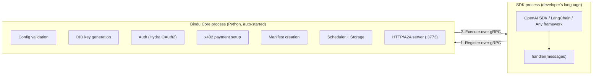
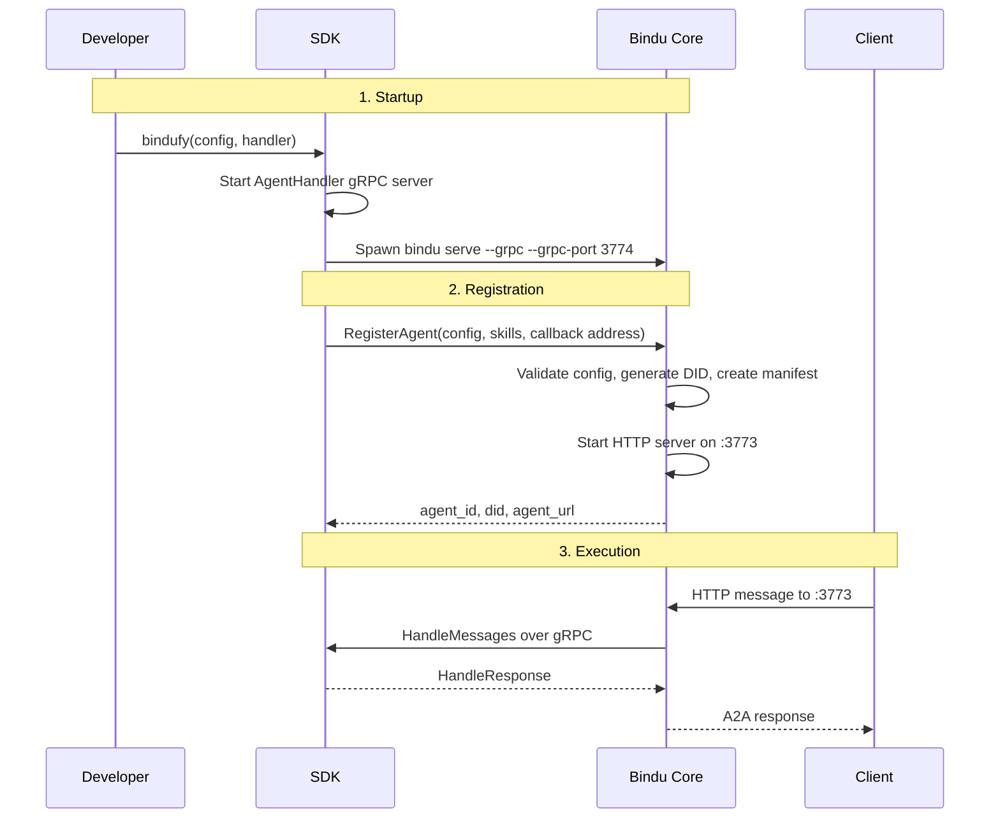

A TypeScript developer writes an agent and calls `bindufy()`. What they see is one agent. What actually runs is a two-process architecture: the SDK process holds the handler, and the Python core holds the infrastructure.

## Why This Architecture Matters

If every language had to reimplement DID, auth, x402, scheduler logic, storage integration, and A2A serving, Bindu would become several parallel runtimes instead of one coherent platform. The architecture exists to avoid that duplication while keeping handler code in the developer's language.

| Rewriting the core per language | Shared gRPC architecture |
| --- | --- |
| DID, auth, x402, scheduler, storage rebuilt in every SDK | One Python core provides the infrastructure once |
| Bugs and fixes repeated across TypeScript, Kotlin, and beyond | Runtime behavior stays aligned across languages |
| Handler logic and infrastructure are tightly coupled | Handler stays in the SDK process, infrastructure stays in the core |
| Supporting a new language means rebuilding the platform | Supporting a new language means adding a thin SDK bridge |
| Cross-language drift becomes inevitable | One code path preserves the same bindufy behavior |

That is the shift: Bindu keeps one infrastructure engine in Python and connects language-specific handlers to it over gRPC. The architecture is split across two processes so the handler can stay local to the developer's language while the core stays shared.

<Note>
The two-process model is not an implementation accident. It is the design choice that prevents infrastructure reimplementation while preserving the same runtime semantics across languages.
</Note>

## How The Architecture Works

The gRPC architecture uses two cooperating processes and two directions of communication. The SDK talks to the core to register and manage the agent. The core talks back to the SDK to execute the handler when work arrives.

### The Big Picture



Two processes. One terminal. The developer only sees their code. The Python process is a hidden child process that the SDK manages automatically.

<CardGroup cols={3}>
  <Card title="One Core" icon="shield-check">
    Infrastructure stays in the Python core instead of being rewritten per language.
  </Card>
  <Card title="Two Directions" icon="link">
    The SDK initiates registration calls and the core initiates handler execution calls.
  </Card>
  <Card title="Same Outcome" icon="code">
    From the outside, the agent behaves the same whether the handler is local Python or remote over gRPC.
  </Card>
</CardGroup>

### The Lifecycle: Startup, Registration, Execution

Under the hood, every gRPC agent moves through three practical stages.



<Steps>
  <Step title="Startup">
    The SDK reads skill files, starts an `AgentHandler` gRPC server on a random available port, detects how to run Python, and spawns the Bindu core as a child process.

    ```text
    SDK process                              Bindu Core (Python, auto-started)
    OpenAI SDK / LangChain   --Register-->   Config validation
    Any framework                           DID key generation
    handler(messages)       <--Execute--    Auth (Hydra OAuth2)
                                             x402 payment setup
                                             Manifest creation
                                             Scheduler + Storage
                                             HTTP/A2A server (:3773)
    ```

    The SDK then waits for `:3774` to be ready by polling with TCP connect for up to 30 seconds.
  </Step>

  <Step title="Registration">
    Registration happens through `BinduService`, which lives in the Python core on `:3774`.

    The SDK calls:

    - `RegisterAgent` - "Here's my config, skills, and callback address. Make me a microservice."
    - `Heartbeat` - "I'm still alive." every 30 seconds
    - `UnregisterAgent` - "I'm shutting down. Clean up."

    During `RegisterAgent`, the core validates config, generates the agent ID, creates DID keys, sets up x402/auth, creates the manifest, attaches `manifest.run = GrpcAgentClient(callback_address)`, starts uvicorn on `:3773` in a background thread, and returns `{agent_id, did, agent_url}` to the SDK.
  </Step>

  <Step title="Execution">
    When a user sends "What is the capital of France?" to a TypeScript agent, the HTTP request lands on `:3773`, the task is queued, and `ManifestWorker` eventually calls:

    ```python
    raw_results = self.manifest.run(message_history or [])
    ```

    For a Python agent, `manifest.run` is a local function. For a gRPC agent, it is a `GrpcAgentClient` instance. That client converts messages to protobuf, calls `HandleMessages` on the SDK's gRPC server, receives `HandleResponse {content: "The capital of France is Paris."}`, and returns the string back into the normal worker pipeline.

    The entire round trip is about `~2-5 seconds`. The gRPC overhead is about `~1-5ms`. The rest is the LLM call.
  </Step>
</Steps>

---

## The Invisible Bridge: GrpcAgentClient

The component that makes the architecture hold together is `GrpcAgentClient`. It is a Python class that pretends to be a handler function.

```python
raw_results = self.manifest.run(message_history or [])
```

For a Python agent, `manifest.run` is a local callable. For a gRPC agent, it is a `GrpcAgentClient` instance. The worker calls it the same way, gets the same result types back, and continues through the same downstream processing.

That is why `ManifestWorker`, `ResultProcessor`, `ResponseDetector`, and the rest of the pipeline do not need separate logic for remote handlers. The abstraction remains a callable.

<Note>
The architecture works because the gRPC boundary is hidden behind a callable interface. The worker does not know or care whether the handler is in-process or remote.
</Note>

### The Runtime Service Split

<CardGroup cols={2}>
  <Card title="BinduService on :3774" icon="link">
    Lives in the Python core and handles registration, heartbeat, and unregister operations from the SDK.
  </Card>
  <Card title="AgentHandler on a Dynamic Port" icon="code">
    Lives in the SDK and handles `HandleMessages`, `GetCapabilities`, and `HealthCheck` calls from the core.
  </Card>
</CardGroup>

This bidirectional design is why gRPC was chosen over REST. Both sides initiate calls. REST cannot do that cleanly without polling or websockets.

## What The SDK Does When You Call `bindufy()`

The startup path from `npx tsx index.ts` to "Waiting for messages..." is deterministic and technical:

<Steps>
  <Step title="Read skill files">
    The SDK loads skill files from the project directory in yaml or markdown form.
  </Step>

  <Step title="Start AgentHandler gRPC server">
    The SDK opens the callback server on a random available port.
  </Step>

  <Step title="Detect Python runtime">
    The SDK checks for `bindu` CLI, `uv`, or `python3`.
  </Step>

  <Step title="Spawn the Bindu core">
    The child process command is `bindu serve --grpc --grpc-port 3774`.
  </Step>

  <Step title="Wait for :3774">
    The SDK polls with TCP connect using a 30 second timeout.
  </Step>

  <Step title="Call RegisterAgent">
    The SDK sends config JSON, skill data, and its callback address.
  </Step>

  <Step title="Core builds the runtime">
    The core validates config, generates agent ID, creates DID keys, sets up x402/auth, and creates the manifest.
  </Step>

  <Step title="Expose the HTTP server">
    Uvicorn starts on `:3773` in a background thread.
  </Step>

  <Step title="Return agent metadata">
    The core returns `{agent_id, did, agent_url}`.
  </Step>

  <Step title="Maintain liveness">
    The SDK starts a heartbeat loop every 30 seconds.
  </Step>

  <Step title="Wait for work">
    The SDK prints confirmation and waits for `HandleMessages` calls.
  </Step>
</Steps>

When the developer presses `Ctrl+C`, the SDK kills the Python child process and exits cleanly.

## Python Vs gRPC Agents

The external behavior is intentionally aligned, but the execution model differs internally.

| | Python Agent | gRPC Agent |
| --- | --- | --- |
| **Developer calls** | `bindufy(config, handler)` | `bindufy(config, handler)` (identical) |
| **Handler runs in** | Same process as core | Separate process |
| **Core started by** | `bindufy()` directly | SDK spawns as child process |
| **Communication** | In-process function call | gRPC over localhost |
| **Latency overhead** | 0ms | 1-5ms |
| **Language** | Python only | Any language with gRPC |
| **DID, auth, x402** | Full support | Full support (identical) |
| **Skills** | Loaded from filesystem | Sent as data during registration |
| **Streaming** | Supported | Not yet implemented |

<Info>
From the outside, there is no visible difference. The agent card looks the same. The DID is generated the same way. The A2A responses have the same structure. The artifacts carry the same DID signatures. A client cannot tell whether the agent behind `:3773` is Python, TypeScript, or Kotlin.
</Info>

## Architectural Scenarios

<AccordionGroup>
  <Accordion title="Why not rewrite the core in every language?">
    The alternative would be to rebuild DID, auth, x402, scheduler, storage, and A2A protocol support in TypeScript, then Kotlin, then Rust, and fix the same bugs repeatedly. The shared-core architecture exists to avoid that duplication.
  </Accordion>

  <Accordion title="Why is gRPC bidirectional here?">
    Because the SDK has to call into the core for `RegisterAgent`, `Heartbeat`, and `UnregisterAgent`, while the core has to call back into the SDK for `HandleMessages`, `GetCapabilities`, and `HealthCheck`.
  </Accordion>

  <Accordion title="What happens during a real message flow?">
    A user sends an HTTP POST to `:3773`. `TaskManager` creates a task, `Scheduler` queues it, `ManifestWorker` builds conversation history from storage, `GrpcAgentClient` calls `HandleMessages` on the SDK, the developer's handler runs, and the core sends the completed A2A response back with a DID-signed artifact.
  </Accordion>

  <Accordion title="What happens on shutdown?">
    The SDK sends liveness signals every 30 seconds while running. When the developer presses `Ctrl+C`, the SDK kills the Python child process and exits cleanly.
  </Accordion>
</AccordionGroup>

## Related

* https://www.getbindu.com
* https://github.com/getbindu/bindu/tree/main/examples

---

<span className="brand-quote">
  

  <span className="brand-quote-text">
    Bindu keeps one runtime{" "}
    <span className="brand-quote-highlight">
      shared at the core, flexible at the edge
    </span>
    , so agents can span languages without splitting the platform.
  </span>
</span>
