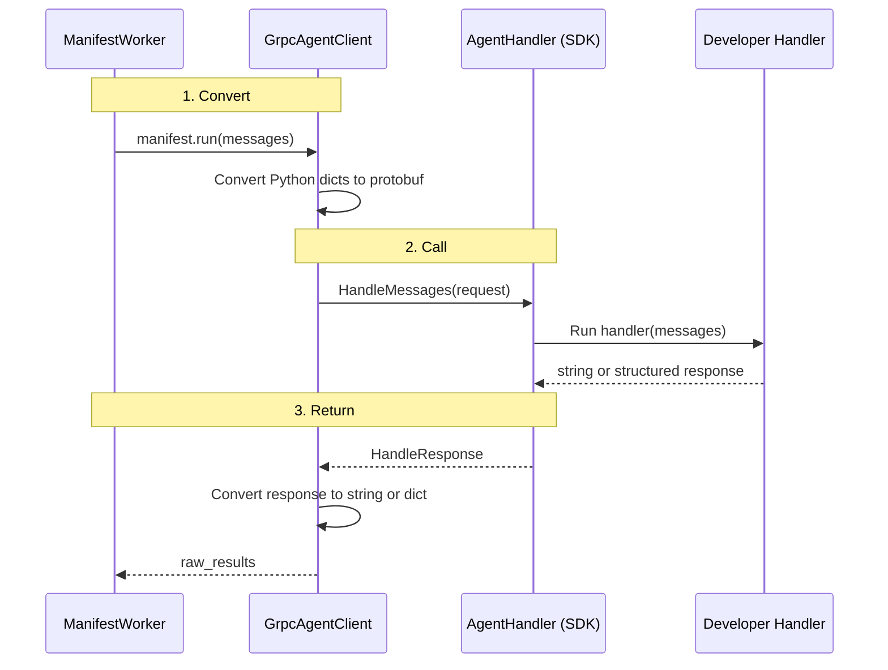

`GrpcAgentClient` exists because the runtime needs one thing above all: `ManifestWorker` must be able to call `manifest.run(messages)` the same way whether the developer's handler lives in Python or in another language process.

## Why GrpcAgentClient Matters

The language-agnostic architecture only works if the rest of Bindu does not have to care that a handler is remote. `ManifestWorker` already handles task state transitions, error handling, tracing, and payment settlement. Rewriting that pipeline to special-case TypeScript or Kotlin handlers would spread transport logic into the core.

| Without `GrpcAgentClient` | With `GrpcAgentClient` |
| --- | --- |
| `ManifestWorker` would need separate logic for local and remote handlers | `ManifestWorker` keeps calling `manifest.run(messages)` the same way |
| gRPC transport details would leak into task execution code | gRPC stays hidden behind a callable Python object |
| Result processing would need branching for remote responses | Downstream code sees the same string-or-dict contract |
| Every worker path would need to understand protobuf and networking | One bridge component handles convert, call, convert back |
| Changing remote handler behavior would risk the execution pipeline | The callable abstraction isolates the transport boundary |

That is the shift: `GrpcAgentClient` makes a remote handler look like a local callable, so the rest of the runtime can stay unchanged. The worker calls a function. The bridge quietly handles the network.

<Note>
The key design constraint is compatibility with the existing worker pipeline. `GrpcAgentClient` solves the transport problem without forcing `ManifestWorker` to learn anything about gRPC.
</Note>

## How GrpcAgentClient Works

`GrpcAgentClient` is a Python class that looks like a function. You call it with messages, it returns a string or dict, and internally it makes a gRPC call to a remote process in another language.

### The Callable Shape

The worker-facing interface stays extremely small:

```python
raw_results = self.manifest.run(message_history or [])
```

For Python agents, `manifest.run` is a wrapper around the developer's handler function. For gRPC agents, `manifest.run` is a `GrpcAgentClient` instance. The caller does not know the difference.

<CardGroup cols={3}>
  <Card title="Callable" icon="code">
    `GrpcAgentClient` behaves like a handler function from the perspective of `ManifestWorker`.
  </Card>
  <Card title="Invisible" icon="link">
    The gRPC request and protobuf conversion stay inside the bridge instead of leaking into the worker.
  </Card>
  <Card title="Compatible" icon="shield-check">
    Downstream systems still receive the same response shapes they expect from local Python handlers.
  </Card>
</CardGroup>

### The Lifecycle: Convert, Call, Return

Under the hood, every `GrpcAgentClient` invocation moves through three practical stages.



<Steps>
  <Step title="Convert">
    `GrpcAgentClient` receives Python message dicts and converts them into protobuf messages before sending them over the wire.

    ```python
    class GrpcAgentClient:
        def __init__(self, callback_address: str, timeout: float = 30.0):
            self._address = callback_address  # e.g., "localhost:50052"
            self._timeout = timeout

        def __call__(self, messages, **kwargs):
            # 1. Convert Python dicts to protobuf
            proto_msgs = [ChatMessage(role=m["role"], content=m["content"]) for m in messages]
            request = HandleRequest(messages=proto_msgs)
    ```

    This is the first half of the bridge: adapt the worker's Python-native shape into the transport format the remote SDK understands.
  </Step>

  <Step title="Call">
    Once the protobuf request is ready, `GrpcAgentClient` calls the SDK's `AgentHandler` service over gRPC.

    ```python
            # 2. Call the SDK's AgentHandler over gRPC
            response = self._stub.HandleMessages(request, timeout=self._timeout)
    ```

    The TypeScript or Kotlin SDK receives that call, runs the developer's handler, and returns a `HandleResponse`.
  </Step>

  <Step title="Return">
    After the response comes back, `GrpcAgentClient` converts it to the same types `ManifestWorker` already expects from a local Python handler.

    <CodeGroup>
      ```python Bridge Logic
            # 3. Convert back to what ManifestWorker expects
            if response.state:
                return {"state": response.state, "prompt": response.prompt}
            else:
                return response.content
      ```

      ```text Outcome
      string response -> completed task flow
      dict response with state -> open task flow
      ```
    </CodeGroup>

    Three steps: convert, call, convert back. That is the entire bridge.
  </Step>
</Steps>

---

## The Response Contract

`ManifestWorker` does not care how the response was produced. It only cares about the type that comes back from `manifest.run(...)`.

| Handler returns | ManifestWorker does | Task state |
| --- | --- | --- |
| `"The capital of France is Paris."` | Creates message + artifact | `completed` |
| `{"state": "input-required", "prompt": "Can you clarify?"}` | Creates message, keeps task open | `input-required` |
| `{"state": "auth-required"}` | Creates message, keeps task open | `auth-required` |

`GrpcAgentClient` returns exactly these types. The downstream code - `ResultProcessor`, `ResponseDetector`, and `ArtifactBuilder` - processes them identically to a local Python handler's output.

<Note>
This response contract is the reason the bridge can stay narrow. The transport is remote, but the return types remain local-runtime compatible.
</Note>

### When It Is Created

During `RegisterAgent`, the gRPC service creates a `GrpcAgentClient` and attaches it to the manifest:

```python
# In BinduServiceImpl.RegisterAgent():
grpc_client = GrpcAgentClient(request.grpc_callback_address)

# In create_manifest():
manifest.run = grpc_client  # GrpcAgentClient IS the handler now
```

From this point on, every task for that agent flows through the client.

## Real Example Flow

The bridge is easiest to understand when followed through one actual request.

<AccordionGroup>
  <Accordion title="A user asks a TypeScript agent a question">
    A user sends "What is quantum computing?" to a TypeScript agent.

    ```text
    ManifestWorker calls manifest.run(messages)
      -> GrpcAgentClient.__call__([{"role": "user", "content": "What is quantum computing?"}])
        -> Converts to protobuf: ChatMessage(role="user", content="What is quantum computing?")
        -> gRPC call: AgentHandler.HandleMessages(HandleRequest{messages: [...]})
        -> TypeScript SDK receives the call
        -> Developer's handler runs: await openai.chat.completions.create(...)
        -> OpenAI returns: "Quantum computing is a type of computation..."
        -> SDK returns: HandleResponse{content: "Quantum computing is...", state: ""}
      -> GrpcAgentClient sees state is empty, returns the string
    -> ManifestWorker receives "Quantum computing is..." (same as a local handler)
    -> ResultProcessor normalizes -> ResponseDetector says "completed"
    -> ArtifactBuilder creates DID-signed artifact
    -> User gets the response
    ```

    `GrpcAgentClient` is the only component in that flow that knows gRPC exists. Everything above and below it remains oblivious.
  </Accordion>

  <Accordion title="Connection lifecycle">
    The client connects lazily. The gRPC channel is created on the first call, not during initialization. This avoids connection errors during registration if the SDK's server is not fully ready yet.

    When the SDK disconnects through `Ctrl+C` or a crash, the next `HandleMessages` call fails with `grpc.StatusCode.UNAVAILABLE`. `ManifestWorker`'s existing error handling catches this and marks the task as failed. No special handling is needed.
  </Accordion>

  <Accordion title="Health checks and capabilities">
    The bridge also exposes runtime checks:

    ```python
    grpc_client.health_check()       # Is the SDK still running? Returns True/False
    grpc_client.get_capabilities()   # What can the SDK do? Returns name, version, etc.
    ```

    These are used during heartbeat processing and capability discovery.
  </Accordion>

  <Accordion title="Current limitations">
    Streaming is not implemented even though the proto defines `HandleMessagesStream`, so remote agents can only return complete responses.

    If the SDK crashes, the client does not reconnect automatically and the agent must be re-registered.

    The bridge uses insecure channels, so it is only safe on localhost or trusted networks.
  </Accordion>
</AccordionGroup>

## Operational Characteristics

<CardGroup cols={2}>
  <Card title="Lazy Connection" icon="link">
    The channel is created on the first call instead of during initialization to reduce startup-time connection failures.
  </Card>
  <Card title="Pipeline Compatibility" icon="code">
    The bridge preserves the same `manifest.run(...)` behavior so the normal task pipeline continues without remote-specific branches.
  </Card>
</CardGroup>

## Related

* https://www.getbindu.com
* https://github.com/getbindu/bindu/tree/main/examples

---

<span className="brand-quote">
  

  <span className="brand-quote-text">
    Bindu keeps the transport{" "}
    <span className="brand-quote-highlight">
      hidden behind a callable
    </span>
    , so remote handlers fit the same runtime shape as local ones.
  </span>
</span>
