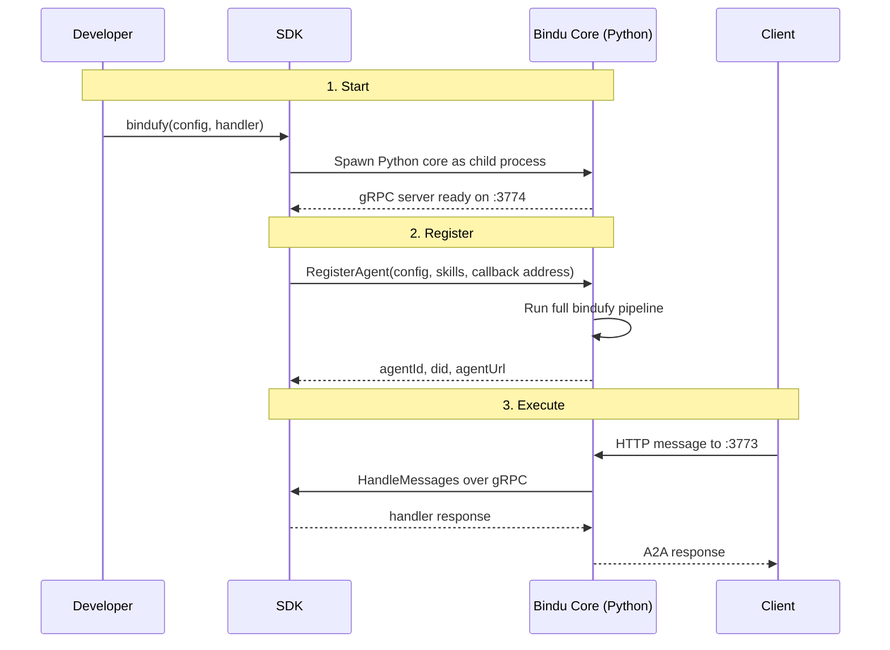

You can build a great agent in TypeScript or Kotlin today. The hard part starts when that agent needs to become a real service with identity, authentication, payments, scheduling, storage, and a protocol other agents can actually talk to.

## Why Language-Agnostic Agents Matter

If every new language integration means reimplementing the same runtime concerns, teams spend their time rebuilding infrastructure instead of improving agent behavior. The handler may already work, but production still demands an HTTP surface, lifecycle management, auth, payments, and a stable request contract.

| Rebuilding infrastructure per language | Bindu gRPC agents |
| --- | --- |
| Every SDK needs its own runtime stack | One Python core provides the shared runtime |
| TypeScript and Kotlin teams repeat the same plumbing | Teams keep logic in their language and reuse the same infrastructure |
| Protocol handling must be reimplemented | A2A and HTTP serving come from the existing Bindu core |
| Auth, payments, storage, and scheduling drift across implementations | The same core path preserves consistent behavior |
| Shipping a new language means months of systems work | Shipping a new language means implementing the handler and SDK bridge |

That is the shift: Bindu lets developers keep the agent logic in their preferred language while the Python core continues to provide the infrastructure layer. The result is the same `bindufy()` outcome, delivered through a gRPC bridge.

<Note>
The point of the gRPC architecture is not just polyglot support. It is preserving one infrastructure implementation while letting teams write handlers in the language they already use.
</Note>

## How Language-Agnostic Agents Work

Bindu's gRPC adapter lets any language call `bindufy()` and get the same microservice a Python agent gets. DID identity, A2A protocol support, x402 payments, OAuth2 auth, Redis scheduling, PostgreSQL storage, and the HTTP server all stay in the Python core.

### The Developer Model

The developer-facing API stays the same:

<CodeGroup>
```python Python
bindufy(config, handler)  # handler runs in the same process
```

```typescript TypeScript
bindufy(config, handler)  // handler runs here, infrastructure runs in Python
```
</CodeGroup>

The function name is the same. The configuration shape is the same. The runtime outcome is the same. The difference is where the handler executes.

<CardGroup cols={3}>
  <Card title="Same API" icon="code">
    Developers still call `bindufy(config, handler)` regardless of language.
  </Card>
  <Card title="Shared Core" icon="shield-check">
    The Python core keeps DID, auth, x402, scheduling, storage, and the HTTP server in one place.
  </Card>
  <Card title="Invisible Bridge" icon="link">
    The gRPC layer stays behind the SDK so developers do not manage proto files or server setup by hand.
  </Card>
</CardGroup>

### The Lifecycle: Start, Register, Execute

Under the hood, every gRPC agent moves through three practical stages.



<Steps>
  <Step title="Start">
    When a developer calls `bindufy()` from TypeScript or another gRPC-enabled SDK, the SDK starts the Bindu core as a child process.

    The Python core handles the infrastructure layer: DID, auth, x402, scheduling, storage, and the HTTP server. The developer does not manually start the core or write any infrastructure bootstrap code.

    ```text
    Client --HTTP--> Bindu Core --gRPC--> SDK Handler --> OpenAI
             :3773    (Python)    :3774
    ```

    In this model, the developer writes the handler. Bindu handles the service runtime around it.
  </Step>

  <Step title="Register">
    Once the core is running, the SDK registers the agent over gRPC by sending the config, skills, and callback address.

    That registration runs the same path a Python agent uses: config validation, DID key generation, manifest creation, and startup of the A2A HTTP server.

    <CodeGroup>
      ```bash Request
      grpcurl -plaintext -emit-defaults \
        -proto proto/agent_handler.proto \
        -import-path proto \
        -d '{
          "config_json": "{\"author\":\"test@example.com\",\"name\":\"test-agent\",\"description\":\"Test\",\"deployment\":{\"url\":\"http://localhost:3773\",\"expose\":true}}",
          "skills": [],
          "grpc_callback_address": "localhost:50052"
        }' \
        localhost:3774 bindu.grpc.BinduService.RegisterAgent
      ```

      ```json Response
      {
        "success": true,
        "agentId": "...",
        "did": "did:bindu:...",
        "agentUrl": "http://localhost:3773"
      }
      ```
    </CodeGroup>

    That response means the full bindufy pipeline ran over gRPC, not a reduced or separate implementation.
  </Step>

  <Step title="Execute">
    When a message arrives at `:3773`, the core receives the HTTP request, processes the A2A flow, and then calls the SDK handler over gRPC.

    The SDK runs the developer's handler, returns the response, and the core sends the final result back to the client.

    Each port has a specific role:

    - `:3773` - HTTP A2A endpoint where clients connect
    - `:3774` - gRPC endpoint where SDKs register with the Bindu core
    - dynamic callback port - gRPC endpoint opened by the SDK so the core can invoke the handler at runtime
  </Step>
</Steps>

---

## Same Result, Different Language

The gRPC layer is invisible to the developer. They do not write proto files, start gRPC servers, or think about serialization. They call `bindufy()`, write a handler, and get a microservice.

<CodeGroup>
```python Python
from bindu.penguin.bindufy import bindufy

config = {
    "author": "dev@example.com",
    "name": "city-guide",
    "deployment": {
        "url": "http://localhost:3773",
        "expose": True,
    },
}

def handler(messages):
    return "Paris is the capital of France."

bindufy(config, handler)
```

```typescript TypeScript
import { bindufy } from "@bindu/sdk";

await bindufy(
  {
    author: "dev@example.com",
    name: "city-guide",
    deployment: {
      url: "http://localhost:3773",
      expose: true,
    },
  },
  async (messages) => {
    return "Paris is the capital of France.";
  }
);
```
</CodeGroup>

The technical contract stays the same:

- the developer writes the handler
- the Python core runs the infrastructure
- the agent is exposed over HTTP on `:3773`
- registration happens over gRPC on `:3774`
- handler execution happens over a dynamic callback port managed by the SDK

<Note>
From the outside, the agent behaves the same way. The difference is internal: Python agents run the handler in-process, while gRPC agents run the handler in a separate language process and bridge to the core over gRPC.
</Note>

### Responsibility Matrix

| Area | Developer / SDK | Bindu Core |
| --- | --- | --- |
| Handler execution | Runs the agent logic in TypeScript, Kotlin, or another language | Calls the handler when work arrives |
| Developer API | Exposes `bindufy(config, handler)` | Runs the same bindufy logic behind registration |
| Infrastructure | Sends config and callback data | Provides DID, auth, x402, scheduling, storage, and HTTP serving |
| Registration | Calls `RegisterAgent` | Validates config, creates manifest, returns agent metadata |
| Message flow | Returns string or structured handler result | Receives HTTP requests and sends final A2A responses |
| Runtime ports | Opens the dynamic callback port for handler execution | Hosts `:3773` for HTTP and `:3774` for gRPC registration |

## Operational View

<CardGroup cols={3}>
  <Card title="HTTP Edge" icon="code">
    `:3773` is the public-facing A2A endpoint for clients and other agents.
  </Card>
  <Card title="gRPC Control" icon="link">
    `:3774` is the control plane where SDKs register and manage agents.
  </Card>
  <Card title="Handler Callback" icon="shield-check">
    The SDK opens a dynamic gRPC port so the core can invoke the handler during request execution.
  </Card>
</CardGroup>

### Quick Test

You can verify the gRPC layer is alive directly from the command line.

<CodeGroup>
  ```bash Start Server
  uv run bindu serve --grpc
  ```

  ```bash List Services
  grpcurl -plaintext localhost:3774 list
  # bindu.grpc.AgentHandler
  # bindu.grpc.BinduService
  ```
</CodeGroup>

The listed services confirm the gRPC server is running and exposing the expected registration and handler interfaces.

## Real Examples

<AccordionGroup>
  <Accordion title="TypeScript + OpenAI">
    This example shows the smallest TypeScript path to a live Bindu agent with one `bindufy()` call.

    https://github.com/getbindu/bindu/tree/main/examples/typescript-openai-agent
  </Accordion>

  <Accordion title="TypeScript + LangChain">
    This example keeps the same runtime model but swaps the handler implementation to LangChain.js.

    https://github.com/getbindu/bindu/tree/main/examples/typescript-langchain-agent
  </Accordion>

  <Accordion title="Kotlin + OpenAI">
    This example applies the same registration and callback pattern from a Kotlin SDK.

    https://github.com/getbindu/bindu/tree/main/examples/kotlin-openai-agent
  </Accordion>

  <Accordion title="gRPC vs. direct Python">
    Python agents call `bindufy(config, handler)` and execute the handler in-process. gRPC agents call the same function shape from another language, but the infrastructure continues to run in the Python core and the handler is invoked remotely over gRPC.
  </Accordion>
 </AccordionGroup>

## Related

* https://www.getbindu.com
* https://github.com/getbindu/bindu/tree/main/examples

---

<span className="brand-quote">
  

  <span className="brand-quote-text">
    Bindu keeps your agent logic{" "}
    <span className="brand-quote-highlight">
      language-flexible and infrastructure-consistent
    </span>
    , so teams can ship handlers instead of rebuilding runtimes.
  </span>
</span>
