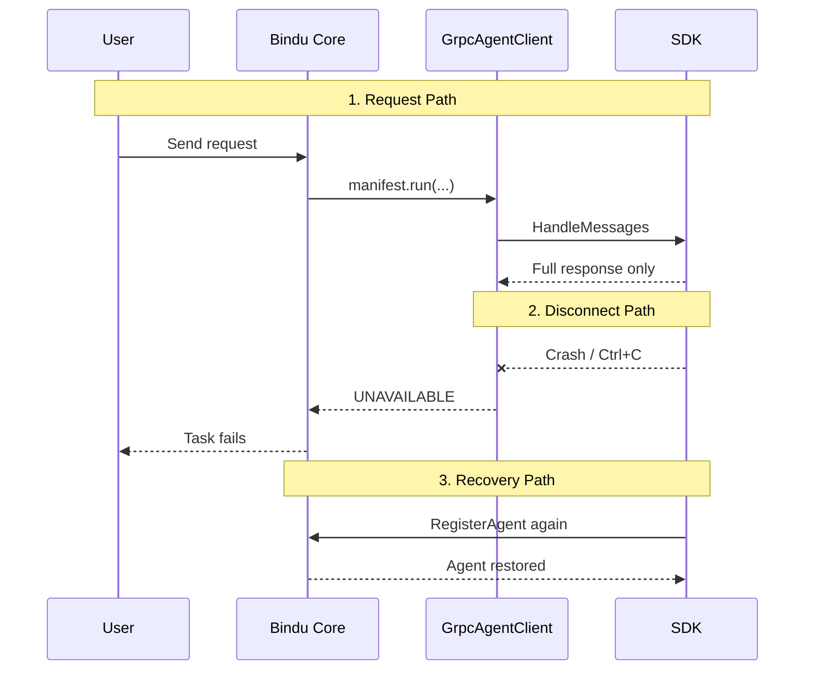

The gRPC path works today for the core parts of Bindu, but it is not finished in every direction. Some gaps are about missing features. Others are trade-offs that were acceptable for localhost development but would need more work for broader deployment.

## Why These Limitations Matter

Most of the important runtime features already work: handler execution, DID identity, x402 payments, skills, state transitions, and health checks. The gaps show up around streaming, transport security, reconnection, observability, and scaling behavior.

| Python agents | gRPC agents today |
| --- | --- |
| In-process handler calls | Remote handler calls over gRPC |
| Streaming already works | Streaming is not implemented |
| No transport channel to secure | gRPC currently uses insecure channels |
| No remote reconnection path needed | SDK disconnects require re-registration |
| Core metrics cover the main execution path | gRPC-specific metrics are not exposed yet |

That is the real picture: gRPC agents already have feature parity for the main Bindu workflow, but they still have rough edges in streaming, security, resilience, and operations.

<Note>
These are current limitations, not hidden gotchas. If you are building against the gRPC path today, this is the part worth reading closely before you make deployment decisions.
</Note>

## How The Current Limitations Break Down

The gaps fall into a few clear buckets: response delivery, transport security, connection handling, runtime visibility, and scaling behavior.

### The Current Surface

<CardGroup cols={3}>
  <Card title="Feature Gaps" icon="code">
    Streaming is defined in the proto but not wired through the runtime yet.
  </Card>
  <Card title="Operational Gaps" icon="link">
    gRPC-specific metrics and built-in load balancing are not available.
  </Card>
  <Card title="Resilience Gaps" icon="shield-check">
    TLS and automatic reconnection are not implemented in the current path.
  </Card>
</CardGroup>

### The Lifecycle: Request, Disconnect, Recover

Under the hood, the limitations show up at three different points in the runtime.

<Steps>
  <Step title="Request Path">
    The normal unary path works. The core calls `HandleMessages`, the SDK runs the handler, and the full response comes back.

    What does not work yet is streaming. The proto defines `HandleMessagesStream`, but `GrpcAgentClient` does not call it, so remote agents can only return complete responses.

    In practice, that means short answers usually feel fine, but long answers land all at once instead of appearing token by token.
  </Step>

  <Step title="Disconnect Path">
    If the SDK process crashes during execution, `GrpcAgentClient` does not retry. The next call fails with gRPC `UNAVAILABLE`, and `ManifestWorker` marks the task as failed.

    The user gets an error response. There is no automatic recovery inside the existing connection path.
  </Step>

  <Step title="Recovery Path">
    Recovery today is explicit. When the SDK starts again, it calls `RegisterAgent` again and the agent is back.

    That works, but it is not the same as automatic reconnection with retry logic or backoff.
  </Step>
</Steps>

---

## Streaming Responses

The proto defines `HandleMessagesStream`, a server-side streaming RPC where the SDK could yield response chunks incrementally. `GrpcAgentClient` does not call it, so remote agents can only return complete responses.

### What This Means In Practice

If you are building a TypeScript agent with GPT-4o, a Python agent can stream tokens back to the user as they are generated. A gRPC agent cannot do that yet. The user waits for the whole response and then sees it all at once.

For short answers, that usually does not matter. For longer responses, especially chat or coding interfaces, the difference is noticeable.

### What Needs To Happen

<Steps>
  <Step title="Add stream_messages() to GrpcAgentClient">
    The client side of the streaming bridge needs to exist first.
  </Step>

  <Step title="Wire it into ManifestWorker">
    The worker path needs a streaming execution route instead of the current unary-only flow.
  </Step>

  <Step title="Update SDK AgentHandler">
    SDK handlers need to support streaming responses end to end.
  </Step>

  <Step title="Add end-to-end tests">
    Streaming round-trips need full integration coverage before the feature is reliable.
  </Step>
</Steps>

## Transport Security

gRPC connections currently use `grpc.insecure_channel`. Traffic between the core and SDK is unencrypted.

<Note>
This is acceptable for the current local model because the core and SDK run on the same machine, usually on localhost, and the SDK spawns the core as a child process.
</Note>

That stops being a reasonable assumption if the core and SDK run on different machines or inside a zero-trust environment. TLS or mTLS support would be needed there.

## Connection And Recovery Limits

The current bridge does not reconnect automatically after an SDK crash. It also does not maintain a connection pool.

| Limitation | Current behavior |
| --- | --- |
| Automatic reconnection | Not implemented. The task fails and the agent must be re-registered |
| Connection pooling | Not implemented. Each `GrpcAgentClient` uses a single gRPC channel |

For most agents, one channel is fine because gRPC handles multiplexing well. Under high concurrency, especially with many simultaneous tasks, a connection pool would reduce contention.

## Visibility And Load Distribution

Two operational gaps remain in the current implementation.

<AccordionGroup>
  <Accordion title="No gRPC-specific metrics">
    The `/metrics` endpoint reports HTTP request metrics, but not gRPC call metrics. You cannot currently see `HandleMessages` latency, error rates, or call counts in the dashboard.

    The practical workaround is to inspect the core's log output, which includes timing information for handler calls.
  </Accordion>

  <Accordion title="No built-in load balancing">
    If you run two instances of the same TypeScript agent, each registers separately with a different callback address. There is no built-in routing layer to spread load across them.

    The current workaround is to place a reverse proxy such as Envoy in front of the SDK instances and register the proxy address as the callback.
  </Accordion>

  <Accordion title="No automatic recovery after SDK restart">
    If the SDK process disappears, the current runtime does not retry or heal around that event. The next handler call fails, the task is marked failed, and the SDK has to register again after restart.
  </Accordion>

  <Accordion title="Localhost assumptions still matter">
    The present design assumes the core and SDK run close together, usually on the same machine. That makes insecure channels acceptable for development, but it is not the right fit for untrusted networks.
  </Accordion>
</AccordionGroup>

## Feature Comparison

| Feature | Python Agents | gRPC Agents |
| --- | --- | --- |
| Unary responses | works | works |
| Streaming responses | works | not implemented |
| DID identity | works | works |
| x402 payments | works | works |
| Skills | works | works |
| State transitions (`input-required`) | works | works |
| Health checks | works | works |
| Multi-language | Python only | any language |
| Latency overhead | 0ms | 1-5ms |
| TLS | N/A (in-process) | not implemented |
| Auto-reconnection | N/A (in-process) | not implemented |

<Info>
The main Bindu workflow is there. The missing pieces are around streaming, transport security, reconnection, metrics, and load distribution.
</Info>

## Practical Advice

<CardGroup cols={2}>
  <Card title="Good Fit Today" icon="shield-check">
    gRPC agents are a solid fit when you need the full Bindu runtime from another language and you are comfortable with unary responses on localhost-style deployments.
  </Card>
  <Card title="Plan Carefully" icon="link">
    If you need token streaming, stronger transport security, or built-in recovery and balancing, assume extra work or wait for those capabilities to land.
  </Card>
</CardGroup>

## Related

* https://www.getbindu.com
* https://github.com/getbindu/bindu/tree/main/examples

---

  

  
    Bindu's gRPC path is{" "}
    
      already useful, but still honest about its edges
    
    , so you can choose it with clear expectations.
  

