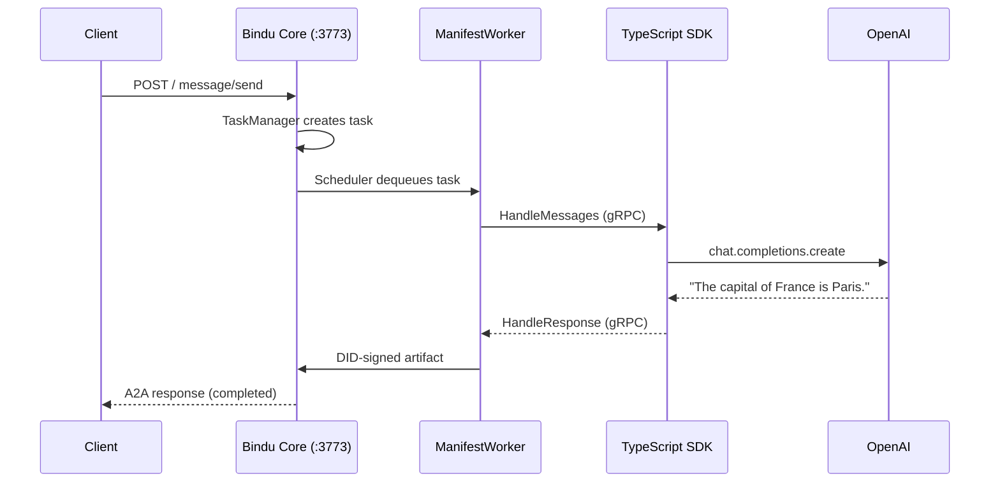

## The Multi-Language Problem

You want to build agent intelligence. What you keep getting dragged into is infrastructure.

You ship a solid TypeScript handler. Then someone asks for Kotlin. Then Python. Suddenly the real work is no longer prompts, tools, or reasoning. It is rebuilding auth, DID identity, A2A protocol handling, x402 payments, scheduling, storage, and service plumbing for every language.

That is the infrastructure trap. The part that should be reusable becomes the part you rewrite the most.

## The Goal: Language-Agnostic Agents

The goal is simple: make the developer write only the brain and let one reusable runtime provide the body.

That means a language-agnostic architecture where the public API stays the same, the infrastructure stays centralized, and teams can move between TypeScript, Kotlin, and Python without losing features or behavior.

The contract should feel boring in the best way:

<CodeGroup>
  ```python Python
  bindufy(config, handler)  # handler runs in the same process
  ```

  ```typescript TypeScript
  bindufy(config, handler)  // handler runs here, infrastructure runs in Python
  ```
</CodeGroup>

Same function name. Same config shape. Same outcome. Different language, same microservice.

## The gRPC Sidecar Architecture

Bindu solves the trap with the sidecar model.

The SDK is the driver. It owns your logic, your framework choices, and your handler.

The Python Core is the engine. It owns the infrastructure: config validation, DID generation, auth, x402, scheduling, storage, manifest creation, and the A2A-facing HTTP server.

The bridge between them is gRPC: a high-performance, open-source RPC framework built on HTTP/2 and Protocol Buffers. Bindu uses it here instead of standard REST for three reasons:

- Strict typing keeps the SDKs and core aligned on one contract.
- Low latency keeps the local transport overhead tiny compared with the LLM call.
- Bidirectional calls let the SDK register with the core, then let the core call back into the SDK when work arrives.

The gRPC layer stays out of your way. You do not write proto files, manually boot a second service, or think about serialization. You call `bindufy()`, write the handler, and the SDK wires up the rest.

## The Big Picture

One process owns the logic. The other owns the infrastructure.

```text
Their TypeScript code                    Bindu Core (Python, auto-started)
+---------------------+                  +----------------------------+
|                     |                  |                            |
|  OpenAI SDK         |  1. Register     |  Config validation         |
|  LangChain          | ------gRPC-----> |  DID key generation        |
|  Any framework      |                  |  Auth (Hydra OAuth2)       |
|                     |                  |  x402 payment setup        |
|  handler(messages)  |  2. Execute      |  Manifest creation         |
|  <------gRPC--------|<---------------- |  Scheduler + Storage       |
|                     |                  |  HTTP/A2A server (:3773)   |
+---------------------+                  +----------------------------+
        SDK process                                  Core process
     (developer's language)                    (Python, invisible)
```

Two processes. One terminal. You see your app. The SDK quietly manages the Python child process.

## Why Two Processes?

Because the alternatives are worse.

Option A: Rewrite the core in every language. DID, auth, x402, scheduler, storage, A2A in TypeScript, then Kotlin, then Python, then whatever comes next. Every bug gets fixed multiple times.

Option B: Keep one core, put a clean wire protocol in front of it, and let thin SDKs translate between the developer and that core.

Bindu chooses Option B. The sidecar is the boundary, and gRPC is the wire.

## What Actually Happens

At runtime, the model is straightforward.

<Steps>
  <Step title="The SDK starts the Bindu Core as a child process">
    The Python core handles DID, auth, x402, scheduling, storage, and the HTTP server.
    You do not manually run a second service. The SDK detects how to launch it and spawns it.
  </Step>

  <Step title="The SDK registers the agent over gRPC">
    It sends config, skills, and a callback address to the core. The core runs the full
    `bindufy` pipeline and starts the A2A HTTP server.
  </Step>

  <Step title="When messages arrive, the core calls the SDK's handler over gRPC">
    A client sends an A2A message to `:3773`. The core receives it, builds task context,
    and calls `manifest.run(messages)`. For a gRPC agent, that becomes a
    `HandleMessages` (or `HandleMessagesStream`) call back into the SDK process.

    ```text
    Client --HTTP--> Bindu Core --gRPC--> TypeScript Handler --> OpenAI
            :3773    (Python)    :3774      (your code)

            DID, Auth, x402                 Just the handler.
            Scheduler, Storage              That's all you write.
            A2A protocol
    ```
  </Step>
</Steps>

That is the contract in one line: you drive the logic, the core runs the engine.

## Two Services, Two Directions

The sidecar works because calls move in both directions. The SDK talks to the core during startup. The core talks back to the SDK during execution.

**BinduService** (lives in the Python core on `:3774`) — the SDK calls this to register and manage its agent:

| Method | What it does |
| --- | --- |
| `RegisterAgent` | "Here is my config, skills, and callback address. Turn me into a microservice." |
| `Heartbeat` | "I am still alive." (every 30 seconds) |
| `UnregisterAgent` | "I am shutting down. Clean up." |

**AgentHandler** (lives in the SDK on a dynamic port) — the core calls this when work arrives:

| Method | What it does |
| --- | --- |
| `HandleMessages` | "A user sent this message. Run your handler and give me the response." |
| `GetCapabilities` | "What can you do?" |
| `HealthCheck` | "Are you still there?" |

This is exactly why Bindu does not use plain REST for this boundary. Both sides need typed contracts and both sides need to initiate calls cleanly.

## Message Flow

Follow one request from the outside world to your code and back. A user sends "What is the capital of France?" to a TypeScript agent that has already been bindufied:



<Steps>
  <Step title="User sends HTTP POST to :3773">
    ```json
    {
      "method": "message/send",
      "params": { "message": { "text": "What is the capital of France?" } }
    }
    ```
  </Step>

  <Step title="Bindu Core receives the request">
    TaskManager creates a task, Scheduler queues it.
  </Step>

  <Step title="ManifestWorker picks up the task">
    Builds conversation history from storage, calls `manifest.run(messages)`.
  </Step>

  <Step title="manifest.run is a GrpcAgentClient">
    Converts messages to protobuf, calls `HandleMessages` on the SDK's gRPC server.
  </Step>

  <Step title="TypeScript SDK receives the call">
    Deserializes messages and calls the developer's handler function.
  </Step>

  <Step title="Developer's handler runs">
    ```typescript
    const response = await openai.chat.completions.create({ model: "gpt-4o", messages })
    // Returns "The capital of France is Paris."
    ```
  </Step>

  <Step title="SDK sends the response back over gRPC">
    `HandleResponse { content: "The capital of France is Paris." }`
  </Step>

  <Step title="Core processes the result">
    ResultProcessor normalizes it → ResponseDetector determines task state → `completed`.
    ArtifactBuilder creates a DID-signed artifact.
  </Step>

  <Step title="Core sends the A2A response back to the user">
    Task completed, with DID signature on the artifact.
  </Step>
</Steps>

The round trip is usually 2–5 seconds. The gRPC overhead is ~1–5ms. Most of the time is the LLM call.

## The Invisible Bridge

Inside the core, one component keeps this model elegant: `GrpcAgentClient`.

It is a callable Python class that behaves exactly like a local handler function. `ManifestWorker` calls it the same way it would call a native Python handler:

```python
raw_results = self.manifest.run(message_history or [])
```

For a Python agent, `manifest.run` is a local function. For a gRPC agent, `manifest.run` is assigned a `GrpcAgentClient` instance. When `ManifestWorker` executes it, Python invokes `GrpcAgentClient.__call__()`, which transparently makes the gRPC call across the boundary. The rest of the pipeline does not need to care.

That is the design win. The sidecar changes the transport, not the downstream architecture.

## Startup Lifecycle

<Steps>
  <Step title="SDK reads skill files">
    Loads skill files from the project directory (yaml or markdown).
  </Step>

  <Step title="SDK starts an AgentHandler gRPC server">
    On a random available port.
  </Step>

  <Step title="SDK detects how to run Python">
    Checks for `bindu` CLI, `uv`, or `python3`.
  </Step>

  <Step title="SDK spawns the Bindu Core">
    As a child process: `bindu serve --grpc --grpc-port 3774`
  </Step>

  <Step title="SDK waits for :3774 to be ready">
    Polls with TCP connect, 30s timeout.
  </Step>

  <Step title="SDK calls RegisterAgent">
    With config JSON, skill data, and its callback address.
  </Step>

  <Step title="Core validates config">
    Generates agent ID, creates DID keys, sets up x402/auth.
  </Step>

  <Step title="Core creates manifest">
    With `manifest.run = GrpcAgentClient(callback_address)`.
  </Step>

  <Step title="Core starts uvicorn">
    On `:3773` in a background thread.
  </Step>

  <Step title="Core returns registration result">
    `{ agent_id, did, agent_url }` to the SDK.
  </Step>

  <Step title="SDK starts a heartbeat loop">
    Pings the core every 30 seconds.
  </Step>

  <Step title="SDK prints confirmation">
    "Agent registered!" and waits for `HandleMessages` calls.
  </Step>
</Steps>

When the developer presses Ctrl+C, the SDK kills the Python child process and exits cleanly.

## Python vs gRPC Agents

From the outside, both models look the same. Inside, the transport path differs.

| | Python Agent | gRPC Agent |
| --- | --- | --- |
| Developer calls | `bindufy(config, handler)` | `bindufy(config, handler)` (identical) |
| Handler runs in | Same process as core | Separate process |
| Core started by | `bindufy()` directly | SDK spawns as child process |
| Communication | In-process function call | gRPC over localhost |
| Latency overhead | 0ms | 1–5ms |
| Language | Python only | Any language with gRPC |
| DID, auth, x402 | Full support | Full support (identical) |
| Skills | Loaded from filesystem | Sent as data during registration |
| Streaming | Supported | Supported |

<Info>
  From the outside, there is no visible difference. The agent card looks the same. The
  DID is generated the same way. The A2A responses have the same structure. The
  artifacts carry the same DID signatures. A client cannot tell whether the agent
  behind `:3773` is Python, TypeScript, or Kotlin.
</Info>

## Real Examples

<CardGroup cols={2}>
  <Card title="TypeScript + OpenAI" icon="code" href="https://github.com/getbindu/bindu/tree/main/examples/typescript-openai-agent">
    GPT-4o agent with one `bindufy()` call
  </Card>
  <Card title="TypeScript + LangChain" icon="link" href="https://github.com/getbindu/bindu/tree/main/examples/typescript-langchain-agent">
    LangChain.js research assistant
  </Card>
  <Card title="Kotlin + OpenAI" icon="code" href="https://github.com/getbindu/bindu/tree/main/examples/kotlin-openai-agent">
    Kotlin agent with the same pattern
  </Card>
</CardGroup>

## Quick Test

If you want to validate the transport layer before writing SDK code, you can test the core directly with `grpcurl`.

```bash
uv run bindu serve --grpc

# In another terminal:
grpcurl -plaintext localhost:3774 list
# -> bindu.grpc.AgentHandler
# -> bindu.grpc.BinduService
```

Register an agent from `grpcurl`:

```bash
grpcurl -plaintext -emit-defaults \
  -proto proto/agent_handler.proto \
  -import-path proto \
  -d '{
    "config_json": "{\"author\":\"test@example.com\",\"name\":\"test-agent\",\"description\":\"Test\",\"deployment\":{\"url\":\"http://localhost:3773\",\"expose\":true}}",
    "skills": [],
    "grpc_callback_address": "localhost:50052"
  }' \
  localhost:3774 bindu.grpc.BinduService.RegisterAgent
```

```json
{ "success": true, "agentId": "...", "did": "did:bindu:...", "agentUrl": "http://localhost:3773" }
```

That response means the full `bindufy` pipeline ran: config validation, DID key generation, manifest creation, and HTTP server startup.

## Ports

| Port | Protocol | Purpose |
| --- | --- | --- |
| `:3773` | HTTP | A2A protocol (clients connect here) |
| `:3774` | gRPC | Agent registration (SDKs connect here) |
| `:XXXXX` | gRPC | Handler execution (core calls SDKs here, dynamic port) |

## Known Limitations

The sidecar model already gives you full parity for core infrastructure. The current gaps are about transport security and edge-case resilience.

<AccordionGroup>
  <Accordion title="No TLS">
    gRPC connections use `grpc.insecure_channel`. Traffic between the core and SDK is
    unencrypted.

    This is acceptable for now because the core and SDK run on the same machine
    (localhost). The SDK spawns the core as a child process — there is no network
    exposure. TLS/mTLS support is planned for remote deployments.
  </Accordion>

  <Accordion title="No Automatic Reconnection">
    If the SDK process crashes mid-execution, the `GrpcAgentClient` does not retry.
    The task fails, and the agent must be re-registered.

    `ManifestWorker` catches the gRPC `UNAVAILABLE` error and marks the task as failed.
    On restart, the SDK calls `RegisterAgent` again.
  </Accordion>

  <Accordion title="No Connection Pooling">
    Each `GrpcAgentClient` creates a single gRPC channel lazily on first use. Under
    high concurrency, all calls share one channel.

    This is fine for most agents because gRPC multiplexes well via HTTP/2. At
    extremely high concurrency, connection pooling would reduce contention.
  </Accordion>

  <Accordion title="No gRPC-Specific Metrics">
    The `/metrics` endpoint reports HTTP request metrics but not gRPC call metrics.
    You cannot see `HandleMessages` latency, error rates, or call counts in the
    dashboard.

    Workaround: check the core log output, which includes timing information for each
    handler call.
  </Accordion>

  <Accordion title="No Load Balancing">
    If you run two instances of the same TypeScript agent, each one registers
    separately with a different callback address. There is no built-in routing to
    spread load across instances.

    Workaround: use a reverse proxy such as Envoy in front of the SDK instances, and
    register the proxy address as the callback.
  </Accordion>
</AccordionGroup>

## Feature Comparison

| Feature | Python Agents | gRPC Agents |
| --- | --- | --- |
| Unary responses | works | works |
| Streaming responses | works | works |
| DID identity | works | works |
| x402 payments | works | works |
| Skills | works | works |
| State transitions (`input-required`) | works | works |
| Health checks | works | works |
| Multi-language | Python only | any language |
| Latency overhead | 0ms | 1–5ms |
| TLS | N/A (in-process) | not implemented |
| Auto-reconnection | N/A (in-process) | not implemented |

<Info>
  The driver/engine split is highly robust. gRPC agents have full parity with Python
  agents for identity, auth, payments, skills, streaming, and the A2A protocol. The
  missing pieces are purely around advanced security hardening and distributed
  resilience.
</Info>

## Next Steps

<CardGroup cols={2}>
  <Card title="Quickstart" icon="rocket" href="/bindu/grpc/quickstart">
    Build your first gRPC agent in 10 minutes
  </Card>
  <Card title="Agent Client" icon="messages" href="/bindu/grpc/agent-client">
    Handlers, state transitions, skills, and debugging
  </Card>
  <Card title="Custom SDKs" icon="code" href="/bindu/grpc/custom-sdks">
    Build SDKs for other languages
  </Card>
  <Card title="API Reference" icon="book" href="/bindu/grpc/api-reference">
    Services, messages, ports, and env vars
  </Card>
</CardGroup>

<span className="brand-quote">
  

  <span className="brand-quote-text">
    Escape the infrastructure trap by keeping your logic entirely decoupled from{" "}
    <span className="brand-quote-highlight">identity, protocols, and routing</span>.
  </span>
</span>
