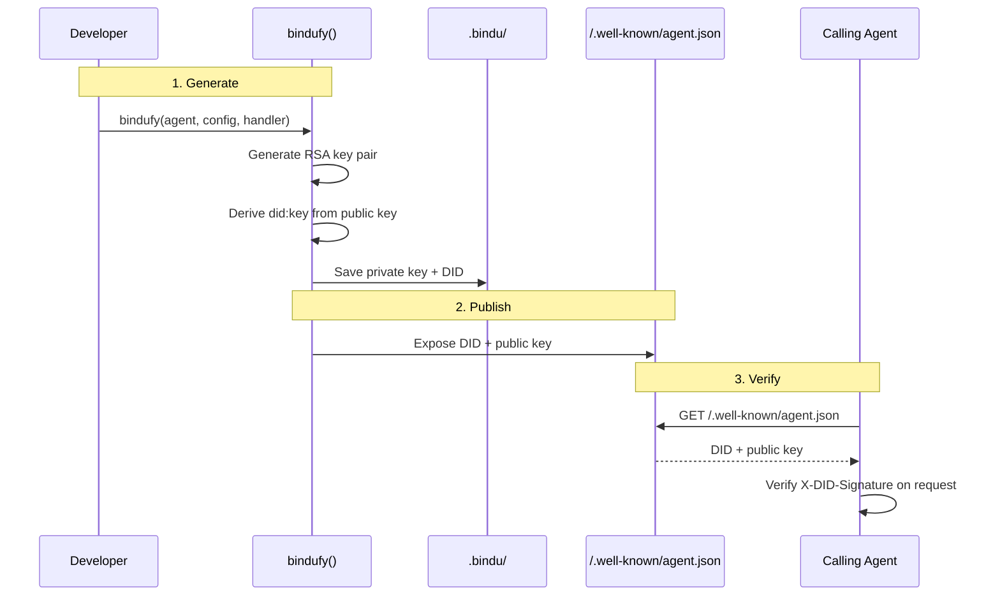

An agent without identity is just a process. The moment it joins a network, other agents need to know who they are talking to, whether that identity can be trusted, and whether the message they received actually came from who it claims.

Without a stable identity layer, agent networks rely on shared secrets, hardcoded allowlists, or implicit trust. That breaks the moment agents span teams, machines, or organizations.

## Why DIDs Matter

In the Internet of Agents, identity should not depend on a central registry or a private convention. Every agent needs a way to prove who it is, independently and verifiably.

| Without DID | With Bindu DID |
| --- | --- |
| Identity is implicit or environment-specific | Every agent has a globally unique identifier |
| Trust depends on shared secrets or allowlists | Identity is cryptographically verifiable |
| No standard way to discover agent capabilities | Agent card published at `/.well-known/agent.json` |
| Hard to reason about who sent a message | DID-signed requests can be verified by any party |
| Fine for local scripts | Required for networked, multi-agent systems |

That is the shift: Bindu gives every agent a DID so identity becomes a first-class property of the agent, not an afterthought bolted on later.

<Note>
  DIDs are automatically generated and managed by Bindu. You do not need to create or
  manage them manually. They are created during `bindufy` and stored in `.bindu/`.
</Note>

## How Bindu DIDs Work

Bindu uses the **`did:key`** method to generate a self-sovereign identity for every agent. The DID is derived from a cryptographic key pair, which means it requires no external registry and can be verified by anyone with the public key.

### The Identity Model

Every Bindu agent gets a DID that looks like this:

```text
did:key:z6MkhaXgBZDvotDkL5257faiztiGiC2QtKLGpbnnEGta2doK
```

This identifier is:

- **Globally unique** - derived from a public key, no two agents share one
- **Self-sovereign** - no central authority issues or controls it
- **Verifiable** - anyone can verify a signature made with the corresponding private key
- **Persistent** - tied to the key pair stored in `.bindu/`

<CardGroup cols={3}>
  <Card title="Self-Sovereign" icon="key">
    No central authority. The DID is derived from the agent&apos;s own key pair.
  </Card>
  <Card title="Verifiable" icon="shield-check">
    Cryptographic signatures prove the message came from the agent that owns the DID.
  </Card>
  <Card title="Discoverable" icon="globe">
    The agent card at `/.well-known/agent.json` publishes the DID and public key.
  </Card>
</CardGroup>

### The Lifecycle: Generate, Publish, Verify



<Steps>
  <Step title="Generate">
    When you call `bindufy()`, Bindu automatically generates an RSA key pair for the
    agent and derives a `did:key` identifier from the public key.

    The private key and DID are saved to `.bindu/` inside your project directory. The
    credentials directory is created if it does not exist.

    ```text
    .bindu/
    ├── did.json              # Agent DID and public key
    ├── private_key.pem       # RSA private key (keep this secret)
    └── oauth_credentials.json  # OAuth client credentials (if auth enabled)
    ```
  </Step>

  <Step title="Publish">
    Bindu exposes the agent&apos;s identity through the standard A2A agent card endpoint.

    Any agent or caller can discover the DID and public key by fetching:

    ```bash
    curl http://localhost:3773/.well-known/agent.json
    ```

    ```json
    {
      "name": "my_agent",
      "description": "My Bindu agent",
      "did": "did:key:z6MkhaXgBZDvotDkL5257faiztiGiC2QtKLGpbnnEGta2doK",
      "publicKey": "-----BEGIN PUBLIC KEY-----\n...\n-----END PUBLIC KEY-----",
      "skills": [...],
      "capabilities": {}
    }
    ```
  </Step>

  <Step title="Verify">
    When `AUTH__ENABLED=true` and a request includes DID signature headers, Bindu
    performs cryptographic verification before the request reaches your handler.

    The three headers that carry the DID proof are:

    ```text
    X-DID: did:key:z6MkhaXgBZDvotDkL5257faiztiGiC2QtKLGpbnnEGta2doK
    X-DID-Signature: <base64-encoded RSA signature of the request body>
    X-DID-Timestamp: 1712345678
    ```

    Bindu fetches the public key from the caller&apos;s agent card, verifies the signature
    against the request body and timestamp, and rejects the request if verification
    fails.
  </Step>
</Steps>

---

## The Agent Card

The agent card is the public face of a Bindu agent. It is served at `/.well-known/agent.json` and follows the A2A protocol specification.

```json
{
  "name": "research_agent",
  "description": "A research assistant agent",
  "version": "1.0.0",
  "did": "did:key:z6MkhaXgBZDvotDkL5257faiztiGiC2QtKLGpbnnEGta2doK",
  "publicKey": "-----BEGIN PUBLIC KEY-----\nMIIBIjANBgkq...\n-----END PUBLIC KEY-----",
  "url": "https://abc123xyz.tunnel.getbindu.com",
  "skills": [
    {
      "id": "question-answering",
      "name": "Question Answering",
      "description": "Answers questions using web search"
    }
  ],
  "capabilities": {
    "streaming": false,
    "pushNotifications": false
  }
}
```

Any agent in the network can use this card to:

- Discover what the agent can do via its skills
- Obtain the public key needed to verify signed requests
- Use the DID as the OAuth `client_id` when authenticating

---

## DID-Signed Requests

When one Bindu agent calls another, it can sign the request body with its private key. The receiving agent verifies the signature using the caller&apos;s public key from their agent card.

### Signing a Request

```python
import base64
import time
import hashlib
from cryptography.hazmat.primitives import hashes, serialization
from cryptography.hazmat.primitives.asymmetric import padding

# Load your agent's private key
with open(".bindu/private_key.pem", "rb") as f:
    private_key = serialization.load_pem_private_key(f.read(), password=None)

# Sign the request body
body = b'{"jsonrpc":"2.0","method":"message/send","params":{...}}'
timestamp = str(int(time.time()))
message = body + timestamp.encode()

signature = private_key.sign(message, padding.PKCS1v15(), hashes.SHA256())
signature_b64 = base64.b64encode(signature).decode()

# Add headers to your request
headers = {
    "X-DID": "did:key:z6MkhaXgBZDvotDkL5257faiztiGiC2QtKLGpbnnEGta2doK",
    "X-DID-Signature": signature_b64,
    "X-DID-Timestamp": timestamp,
}
```

### Verifying a Request

Bindu handles verification automatically when `AUTH__ENABLED=true`. The middleware:

1. Reads `X-DID` from the request headers
2. Fetches the caller&apos;s agent card to get their public key
3. Verifies the signature against the request body and timestamp
4. Rejects requests with invalid or missing signatures

<Note>
  DID signature verification is optional and layered on top of OAuth2 token
  authentication. You can use either or both depending on your trust requirements.
</Note>

---

## Configuration

DID generation is automatic. There is nothing to configure for basic usage.

### Key Storage

By default, Bindu stores keys in `.bindu/` relative to your project directory. Treat this directory as sensitive material.

```bash
# Add to .gitignore
echo ".bindu/" >> .gitignore
```

### Environment Variables

```bash
# Optional: custom credentials directory
BINDU__CREDENTIALS_DIR=/path/to/secure/storage

# Enable DID signature verification on incoming requests
AUTH__ENABLED=true
AUTH__PROVIDER=hydra
```

### Rotating Keys

If you need to rotate the agent&apos;s key pair, delete the `.bindu/` directory and restart the agent. A new key pair and DID will be generated automatically.

<Note>
  Rotating keys changes the agent&apos;s DID. Any OAuth clients registered under the old
  DID will need to be re-registered. Update any callers that have cached the old agent
  card.
</Note>

---

## DID and OAuth2

Bindu uses the agent&apos;s DID as the OAuth2 `client_id` when registering with Ory Hydra. This ties the cryptographic identity directly to the authentication layer.

```text
DID → OAuth client_id → access token → authenticated request
```

This means:

- The DID is the stable identity anchor across both the cryptographic and token-based trust models
- Revoking an OAuth client is tied to a specific DID
- Token introspection reveals which agent DID made the request

See [Authentication](/bindu/learn/authentication/overview) for the full OAuth2 flow.

---

## Real-World Use Cases

<AccordionGroup>
  <Accordion title="Agent-to-agent trust">
    When one Bindu agent calls another, the receiving agent can verify the caller&apos;s
    identity by checking the DID signature headers against the caller&apos;s published
    public key. No shared secret required.
  </Accordion>

  <Accordion title="Audit trails">
    Because every request can carry a DID signature, you get a cryptographically
    verifiable record of which agent sent which message. Useful for compliance and
    debugging in multi-agent pipelines.
  </Accordion>

  <Accordion title="Capability discovery">
    Orchestrators can fetch `/.well-known/agent.json` from any Bindu agent to discover
    its DID, skills, and capabilities before deciding whether to delegate a task to it.
  </Accordion>

  <Accordion title="Cross-organization agent networks">
    DIDs work without a shared registry. Two agents from different organizations can
    verify each other&apos;s identity as long as they can reach each other&apos;s agent card
    endpoint.
  </Accordion>
</AccordionGroup>

---

## Security Best Practices

<CardGroup cols={2}>
  <Card title="Protect the Private Key" icon="lock">
    Never commit `.bindu/private_key.pem` to version control. Add `.bindu/` to your
    `.gitignore` and treat it like a production secret.
  </Card>
  <Card title="Validate Timestamps" icon="clock">
    DID signature verification includes a timestamp. Bindu rejects requests where the
    timestamp is too far from the current time to prevent replay attacks.
  </Card>
  <Card title="Use HTTPS in Production" icon="shield-check">
    The agent card is served over HTTP locally. In production, always serve it over
    HTTPS so the public key cannot be tampered with in transit.
  </Card>
  <Card title="Rotate Keys on Compromise" icon="rotate">
    If a private key is exposed, delete `.bindu/` and restart the agent immediately.
    Re-register the new DID with any dependent services.
  </Card>
</CardGroup>

---

## Related

- [Authentication](/bindu/learn/authentication/overview)
- [W3C DID Specification](https://www.w3.org/TR/did-core/)
- [did:key Method](https://w3c-ccg.github.io/did-method-key/)
- [A2A Protocol](https://google.github.io/A2A/)

<span className="brand-quote">
  

  <span className="brand-quote-text">
    Every Bindu agent has a name the whole internet can verify -{" "}
    <span className="brand-quote-highlight">no registry, no middleman</span>,
    just a key pair and a proof.
  </span>
</span>
