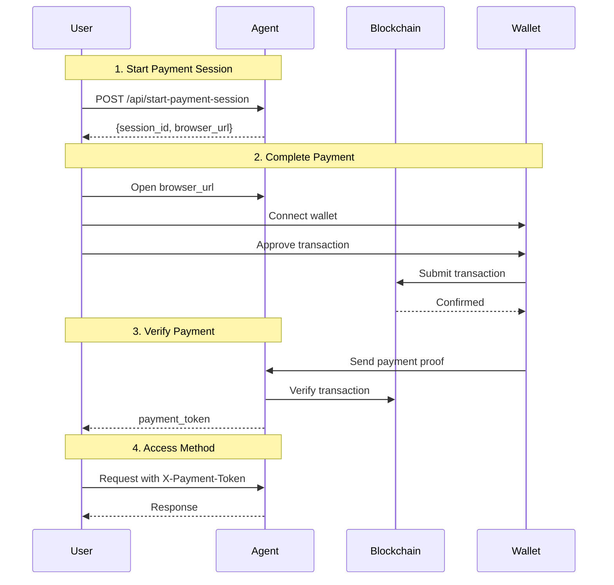

---

title: "Payment Integration (X402)"
description: "Monetize AI agents with verifiable, on-chain payments"
---

Bindu supports the **X402 payment protocol**, allowing you to require payments before executing specific agent methods.

In simple terms:

**Users pay → receive a payment token → use that token to access paid functionality.**

Bindu manages the full lifecycle: session creation, payment capture, on-chain verification, and access control.

---

## Overview

### What is a Payment Token?

A **payment token** is a short-lived JWT issued after a successful payment.

It represents proof that a user has paid and must be included in subsequent requests to access protected methods.

---

### System Model

Bindu’s payment system works as follows:

1. A payment session is created
2. The user completes payment via their wallet
3. The transaction is confirmed on-chain
4. Bindu verifies the transaction
5. A payment token is issued
6. The token is used to access protected methods

---

## Why X402?

Traditional payment systems are not designed for autonomous agents.

X402 enables:

* Direct payments without intermediaries
* On-chain verification of transactions
* Native integration with agent workflows
* No reliance on centralized payment providers

### When to Use X402

Use X402 when:

* You need agent-to-agent or programmatic payments
* You want verifiable, trustless transactions
* You are building crypto-native applications

Use traditional systems when:

* You require fiat payments
* You need subscriptions or recurring billing
* You rely on centralized payment infrastructure

---

## How It Works



---

## Quick Start

1. Add `execution_cost` to your agent config
2. Start your agent
3. Call a protected method
4. Complete payment in browser
5. Use the returned payment token

You now have a paid agent.

---

## Setup (Testing)

If you're new to crypto, follow this section. Otherwise, skip to configuration.

### 1. Create a Wallet

* MetaMask (recommended)
* Coinbase Wallet

### 2. Get Test Funds

* Get Base Sepolia ETH (for gas)
* Obtain test USDC

### 3. Set Your Wallet Address

```python
"pay_to_address": "0xYourWalletAddressHere"
```

---

## Configuration

### Single Payment Option

```python
config = {
    "author": "your.email@example.com",
    "name": "paid_agent",
    "description": "An agent that requires payment",
    "deployment": {"url": "http://localhost:3773", "expose": True},
    "execution_cost": {
        "amount": "$0.0001",
        "token": "USDC",
        "network": "base-sepolia",
        "pay_to_address": "0xYourWalletAddressHere",
        "protected_methods": ["message/send"]
    }
}
```

---

### Multiple Payment Options

You can provide multiple payment options. Any one of them satisfies access.

```python
config = {
    "execution_cost": [
        {
            "amount": "0.1",
            "token": "USDC",
            "network": "base",
            "pay_to_address": "0xYourWalletAddressHere",
        },
        {
            "amount": "0.0001",
            "token": "ETH",
            "network": "ethereum",
            "pay_to_address": "0xYourWalletAddressHere",
        }
    ]
}
```

---

## Payment Flow (Detailed)

### 1. Start Payment Session

```bash
curl -X POST http://localhost:3773/api/start-payment-session \
  -H "Content-Type: application/json" \
  -H "Authorization: Bearer <token>"
```

---

### 2. Complete Payment

* Open `browser_url`
* Connect wallet
* Approve transaction
* Wait for blockchain confirmation

---

### 3. Verify Payment

```bash
curl http://localhost:3773/api/payment-status/<session_id>
```

Response:

```json
{
  "status": "completed",
  "payment_token": "<token>"
}
```

---

### 4. Call Protected Method

```bash
curl http://localhost:3773/ \
  -H "X-Payment-Token: <token>" \
  -d '{ "method": "message/send" }'
```

---

## Payment Behavior

* Each task requires a new payment
* Tokens are task-specific and non-reusable
* `input_required` steps do not require payment
* Tokens expire after a short duration

---

## Trust & Verification

Bindu verifies payments using blockchain data:

* Validates transaction signature
* Confirms sender and recipient addresses
* Checks payment amount
* Ensures transaction exists on-chain

Only verified transactions result in token issuance.

---

## Security Model

* Payment tokens are bound to sessions
* Tokens are short-lived and expire automatically
* Tokens cannot be reused across tasks
* Duplicate or replay usage is prevented via session tracking

---

## UI Integration

Bindu provides a built-in payment UI via `browser_url`.

Typical frontend flow:

1. Start payment session
2. Redirect user to payment UI
3. Wait for completion
4. Retrieve `payment_token`
5. Attach token to API requests

---

## Common Issues

* Session expired → start a new session
* Payment pending → wait for confirmation
* Invalid token → ensure correct session
* Wrong network → switch wallet network

---

## Production Deployment

1. Switch to mainnet:

```python
"network": "base"
```

2. Use real USDC
3. Set production wallet address
4. Monitor incoming payments
5. Adjust pricing

---

## Tips

* Start with small amounts
* Clearly communicate pricing
* Handle failures gracefully
* Clean expired sessions
* Optimize user experience

---

## Example

```
examples/beginner/echo_agent_behind_paywall.py
```

---

## Related

* https://github.com/coinbase/x402
* https://docs.base.org/network-information
* ./AUTHENTICATION.md
