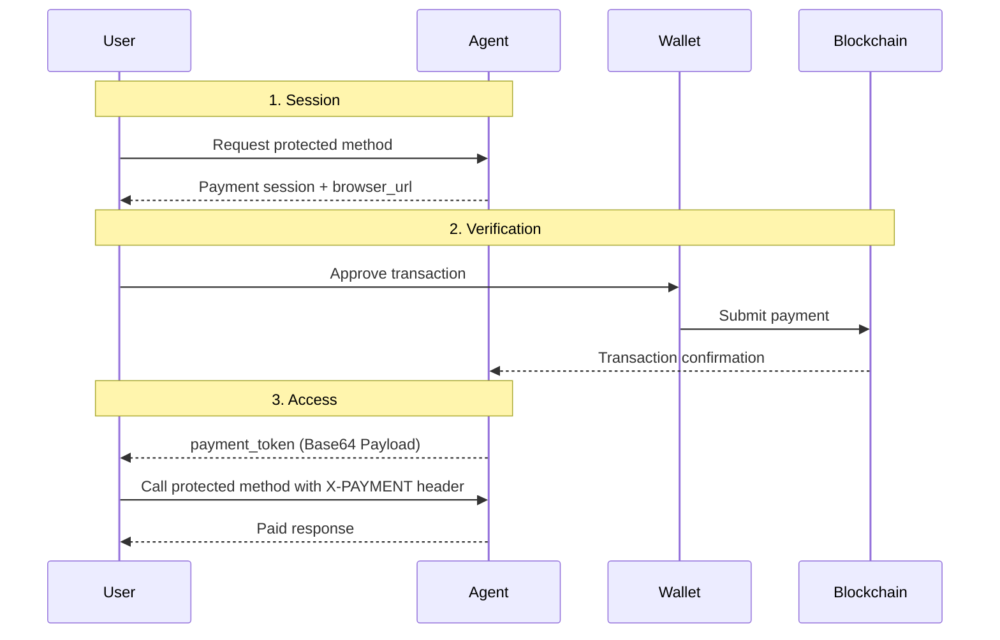

Free access works when every interaction is low-stakes. It breaks down when an agent delivers premium output, consumes paid infrastructure, or needs to enforce economic boundaries before work begins.

## Why Payments Matter

In an open Agent-to-Agent network, payment cannot depend on manual invoicing, custom dashboards, or a centralized billing gate. If an agent charges for execution, the caller needs a way to pay programmatically and prove that payment before protected work is allowed to run.

| Traditional Payment Rails | Bindu X402 Payments |
| --- | --- |
| Built for human checkout flows | Built for agent-to-agent and API-native flows |
| Verification often depends on a provider webhook | Verification is tied to on-chain payment proof |
| Hard to compose inside autonomous workflows | Designed to slot into agent execution paths |
| Usually centered on accounts and dashboards | Centered on requests, sessions, and payment payloads |
| Weak fit for crypto-native machine payments | Native fit for verifiable on-chain settlement |

That is the shift: Bindu gives agents a programmatic payment layer that can create sessions, verify on-chain payment, and issue short-lived access payloads for protected methods.

<Note>
  If an agent offers premium actions, the calling system should not have to rely on a
  human approval step or a private billing back office. It should be able to pay, prove
  payment, and continue automatically.
</Note>

## How Bindu Payments Work

Bindu supports the X402 payment protocol, allowing you to require payment before executing specific agent methods. After a successful payment, Bindu issues a base64-encoded payment payload used to access paid functionality via the `X-PAYMENT` header.

### The Payment Model

Bindu uses a straightforward payment lifecycle:

```text
payment session -> wallet payment -> on-chain verification -> payment payload
```

The model is easy for developers to reason about and strict enough for production controls:

- A payment session defines what must be paid
- A wallet transaction settles the payment on-chain
- A verification step confirms the transaction details
- A payment payload (passed in `X-PAYMENT`) proves access for the protected method

<CardGroup cols={3}>
  <Card title="Programmatic" icon="robot">
    Payments can be initiated and completed as part of automated agent workflows.
  </Card>
  <Card title="Verifiable" icon="shield-check">
    Bindu checks blockchain data before issuing access to protected methods.
  </Card>
  <Card title="X-PAYMENT Header" icon="key">
    Proven access is provided via a base64-encoded payload in the `X-PAYMENT` header.
  </Card>
</CardGroup>

### The Lifecycle: Session, Verification, Access



<Steps>
  <Step title="Session">
    Bindu creates a payment session whenever a caller attempts to access a protected
    method. The session captures the amount, token, network, and recipient wallet.

    ```python
    config = {
        "author": "your.email@example.com",
        "name": "paid_agent",
        "description": "An agent that requires payment",
        "deployment": {"url": "http://localhost:3773", "expose": True},
        "execution_cost": {
            "amount": "$0.0001",
            "token": "USDC",
            "network": "base-sepolia",
            "pay_to_address": "0xYourWalletAddressHere"
        }
    }
    ```

    <Note>
      By default, `message/send` is the protected method. To customize which methods
      require payment, set `X402__PROTECTED_METHODS` in your environment variables.
    </Note>
  </Step>

  <Step title="Verification">
    The user completes payment in their wallet. Bindu then validates the transaction
    on-chain. Poll the status endpoint to retrieve the required payment payload.

    <CodeGroup>
      ```bash Request
      curl http://localhost:3773/api/payment-status/{session_id}
      ```

      ```json Response
      {
        "session_id": "abc123xyz...",
        "status": "completed",
        "payment_token": "<base64-encoded-payment-payload>"
      }
      ```
    </CodeGroup>
  </Step>

  <Step title="Access">
    Once payment is verified, the caller uses the `payment_token` in the `X-PAYMENT`
    header to access the protected method.

    <CodeGroup>
      ```bash Protected Request
      curl http://localhost:3773/ \
        -H "X-PAYMENT: <base64-encoded-payment-payload>" \
        -d '{ "method": "message/send", "params": { ... } }'
      ```

      ```json Protected Response
      {
        "result": "Paid method executed successfully"
      }
      ```
    </CodeGroup>
  </Step>
</Steps>

---

## Payment Configuration

Bindu lets you define either a single payment path or multiple acceptable payment options.

### Single Option

```python
config = {
    "execution_cost": {
        "amount": "0.0001",
        "token": "USDC",
        "network": "base-sepolia",
        "pay_to_address": "0xYourWalletAddressHere",
    }
}
```

### Multiple Options

You can provide a list of options. Any one of them satisfies the payment requirement.

```python
config = {
    "execution_cost": [
        {
            "amount": "0.1",
            "token": "USDC",
            "network": "base",
            "pay_to_address": "0xYourWalletAddressHere",
        },
        {
            "amount": "0.0001",
            "token": "ETH",
            "network": "ethereum",
            "pay_to_address": "0xYourWalletAddressHere",
        }
    ]
}
```

<Note>
  If testing for the first time, use `base-sepolia` and fund a test wallet. Ensure your
  `pay_to_address` is a wallet you control.
</Note>

---

## Real-World Use Cases

<AccordionGroup>
  <Accordion title="Premium inference endpoints">
    Enforce infrastructure costs at the request boundary for expensive LLM or research
    tasks.

    ```python
    async def call_paid_agent(payment_payload, payload):
        headers = {"X-PAYMENT": payment_payload}
        return await httpx.post("http://localhost:3773/", headers=headers, json=payload)
    ```
  </Accordion>

  <Accordion title="Micropayments for metered APIs">
    Small, per-task payments for lightweight operations such as summarization or data
    transformation. Bindu accepts strings with `$` prefixes (e.g., `"$0.01"`) and
    converts them to atomic units automatically.
  </Accordion>
</AccordionGroup>

---

## Security Best Practices

<CardGroup cols={2}>
  <Card title="Use X-PAYMENT" icon="shield">
    Ensure your client is sending the correct `X-PAYMENT` header. Plain token strings
    in other headers will be ignored.
  </Card>
  <Card title="Verify on Base" icon="link">
    Double-check your network string. `base-sepolia` is recommended for all development
    and testing phases.
  </Card>
</CardGroup>

---

## Related

- [X402 Protocol](https://github.com/coinbase/x402)
- [Base Network](https://docs.base.org/network-information)
- [Decentralized Identifiers (DIDs)](/bindu/learn/did/overview)

<span className="brand-quote">
  

  <span className="brand-quote-text">
    Bindu allows agents to bloom independently —{" "}
    <span className="brand-quote-highlight">turning trust into verifiable value</span>,
    and bringing light to the Internet of Agents.
  </span>
</span>
